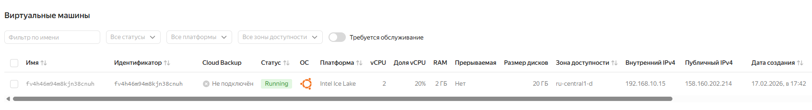

## Домашее задание № 1 Terraform

### Занятие 3. Практическое занятие по использованию Terraform

Цель:
cоздать и запустить базовый Terraform скрипт для автоматизации установки и настройки виртуальной машины в рабочем окружении;
получить базовые навыки работы с Terraform для создания и управления инфраструктурой;
понять принципы IaC (Infrastructure as Code) и научиться применять их для автоматизации инфраструктуры;


Описание/Пошаговая инструкция выполнения домашнего задания:

1. Подготовка окружения:

ОС Microsoft Windows 11
Terraform v1.14.5
Yandex Cloud CLI 0.185.0
Terraform Provider Yanedx v0.187.0

2. Настройка провайдера
 - terraform.rc
```

```
 - main.tf
```
 required_providers {
    yandex = {
      source = "yandex-cloud/yandex"
    }
  }
  required_version = ">= 0.13"
}
provider "yandex" {
  zone = var.zone
}
```
3. Инициализация Terraform

```
terraform init
```

4. Настройка Yandex CLI

```
yc init
$Env:YC_TOKEN=$(yc iam create-token) 
$Env:YC_CLOUD_ID=$(yc config get cloud-id)
$Env:YC_FOLDER_ID=$(yc config get folder-id)
```
5. Написание манифестов Terraform

Манифесты составлены с учетом модульности и выноса переменных в отдельные файлы по следующей структуре:

|- main.tf  //Основной файл
|- variables.tf  //Объявление переменных
|- outputs.tf   //Выходные переменные
|- vm.tf   //Манифест создания ресурсов ВМ
|- locals.tf  //Локальные файлы

6. Предварительная проверка написанных манифестов

```
terraform validate                          
Success! The configuration is valid.
terraform plan
terraform plan
data.yandex_compute_image.ubuntu: Reading...
data.yandex_compute_image.ubuntu: Read complete after 1s [id=fd8lt661chfo5i13a40d]

Terraform used the selected providers to generate the following execution plan. Resource actions are indicated with the following symbols:
  + create

Terraform will perform the following actions:

  # yandex_compute_disk.boot-disk will be created
  + resource "yandex_compute_disk" "boot-disk" {
      + block_size  = 4096
      + created_at  = (known after apply)
      + folder_id   = (known after apply)
      + id          = (known after apply)
      + image_id    = "fd8lt661chfo5i13a40d"
      + name        = "boot-disk-1"
      + product_ids = (known after apply)
      + size        = 20
      + status      = (known after apply)
      + type        = "network-hdd"
      + zone        = "ru-central1-d"

      + disk_placement_policy (known after apply)

      + hardware_generation (known after apply)
    }

  # yandex_compute_instance.vm-for-each["otus-vm"] will be created
  + resource "yandex_compute_instance" "vm-for-each" {
      + created_at                = (known after apply)
      + folder_id                 = (known after apply)
      + fqdn                      = (known after apply)
      + gpu_cluster_id            = (known after apply)
      + hardware_generation       = (known after apply)
      + hostname                  = (known after apply)
      + id                        = (known after apply)
      + maintenance_grace_period  = (known after apply)
      + maintenance_policy        = (known after apply)
      + metadata                  = {
          + "ssh-keys" = <<-EOT
                admind:ssh-ed25519 AAAAC3NzaC1lZDI1NTE5AAAAIJa058WM5gnQsHPKWanqd10t+39ExT+j3GtAuD5zXYER maksim@DESKTOP-DHVBQLG
            EOT
        }
      + network_acceleration_type = "standard"
      + platform_id               = "standard-v3"
      + status                    = (known after apply)
      + zone                      = (known after apply)

      + boot_disk {
          + auto_delete = true
          + device_name = (known after apply)
          + disk_id     = (known after apply)
          + mode        = (known after apply)

          + initialize_params (known after apply)
        }

      + metadata_options (known after apply)

      + network_interface {
          + index          = (known after apply)
          + ip_address     = (known after apply)
          + ipv4           = true
          + ipv6           = (known after apply)
          + ipv6_address   = (known after apply)
          + mac_address    = (known after apply)
          + nat            = true
          + nat_ip_address = (known after apply)
          + nat_ip_version = (known after apply)
          + subnet_id      = (known after apply)
        }

      + placement_policy (known after apply)

      + resources {
          + core_fraction = 4
          + cores         = 2
          + memory        = 2
        }

      + scheduling_policy (known after apply)
    }

  # yandex_vpc_network.otus-network will be created
  + resource "yandex_vpc_network" "otus-network" {
      + created_at                = (known after apply)
      + default_security_group_id = (known after apply)
      + folder_id                 = (known after apply)
      + id                        = (known after apply)
      + labels                    = (known after apply)
      + name                      = "otus-network"
      + subnet_ids                = (known after apply)
    }

  # yandex_vpc_subnet.otus-hli-subnet will be created
  + resource "yandex_vpc_subnet" "otus-hli-subnet" {
      + created_at     = (known after apply)
      + folder_id      = (known after apply)
      + id             = (known after apply)
      + labels         = (known after apply)
      + name           = "otus-hli-subnet"
      + network_id     = (known after apply)
      + v4_cidr_blocks = [
          + "192.168.10.0/24",
        ]
      + v6_cidr_blocks = (known after apply)
      + zone           = "ru-central1-d"
    }

Plan: 4 to add, 0 to change, 0 to destroy.

Changes to Outputs:
  + external_ip_address_vm = [
      + {
          + nat_ip_address = (known after apply)
        },
    ]
  + internal_ip_address_vm = [
      + {
          + ip_address = (known after apply)
        },
    ]

─────────────────────────────────────────────────────────────────────────────────────────────────────────────────────────────────────────────────────────────────────────────────

```
7. Применияем манифесты
```
terraform apply
data.yandex_compute_image.ubuntu: Reading...
data.yandex_compute_image.ubuntu: Read complete after 0s [id=fd8lt661chfo5i13a40d]

Terraform used the selected providers to generate the following execution plan. Resource actions are indicated with the following symbols:
  + create

Terraform will perform the following actions:

  # yandex_compute_disk.boot-disk will be created
  + resource "yandex_compute_disk" "boot-disk" {
      + block_size  = 4096
      + created_at  = (known after apply)
      + folder_id   = (known after apply)
      + id          = (known after apply)
      + image_id    = "fd8lt661chfo5i13a40d"
      + name        = "boot-disk-1"
      + product_ids = (known after apply)
      + size        = 20
      + status      = (known after apply)
      + type        = "network-hdd"
      + zone        = "ru-central1-d"

      + disk_placement_policy (known after apply)

      + hardware_generation (known after apply)
    }

  # yandex_compute_instance.vm-for-each["otus-vm"] will be created
  + resource "yandex_compute_instance" "vm-for-each" {
      + created_at                = (known after apply)
      + folder_id                 = (known after apply)
      + fqdn                      = (known after apply)
      + gpu_cluster_id            = (known after apply)
      + hardware_generation       = (known after apply)
      + hostname                  = (known after apply)
      + id                        = (known after apply)
      + maintenance_grace_period  = (known after apply)
      + maintenance_policy        = (known after apply)
      + metadata                  = {
          + "ssh-keys" = <<-EOT
                admind:ssh-ed25519 AAAAC3NzaC1lZDI1NTE5AAAAIJa058WM5gnQsHPKWanqd10t+39ExT+j3GtAuD5zXYER maksim@DESKTOP-DHVBQLG
            EOT
        }
      + network_acceleration_type = "standard"
      + platform_id               = "standard-v3"
      + status                    = (known after apply)
      + zone                      = (known after apply)

      + boot_disk {
          + auto_delete = true
          + device_name = (known after apply)
          + disk_id     = (known after apply)
          + mode        = (known after apply)

          + initialize_params (known after apply)
        }

      + metadata_options (known after apply)

      + network_interface {
          + index          = (known after apply)
          + ip_address     = (known after apply)
          + ipv4           = true
          + ipv6           = (known after apply)
          + ipv6_address   = (known after apply)
          + mac_address    = (known after apply)
          + nat            = true
          + nat_ip_address = (known after apply)
          + nat_ip_version = (known after apply)
          + subnet_id      = (known after apply)
        }

      + placement_policy (known after apply)

      + resources {
          + core_fraction = 4
          + cores         = 2
          + memory        = 2
        }

      + scheduling_policy (known after apply)
    }

  # yandex_vpc_network.otus-network will be created
  + resource "yandex_vpc_network" "otus-network" {
      + created_at                = (known after apply)
      + default_security_group_id = (known after apply)
      + folder_id                 = (known after apply)
      + id                        = (known after apply)
      + labels                    = (known after apply)
      + name                      = "otus-network"
      + subnet_ids                = (known after apply)
    }

  # yandex_vpc_subnet.otus-hli-subnet will be created
  + resource "yandex_vpc_subnet" "otus-hli-subnet" {
      + created_at     = (known after apply)
      + folder_id      = (known after apply)
      + id             = (known after apply)
      + labels         = (known after apply)
      + name           = "otus-hli-subnet"
      + network_id     = (known after apply)
      + v4_cidr_blocks = [
          + "192.168.10.0/24",
        ]
      + v6_cidr_blocks = (known after apply)
      + zone           = "ru-central1-d"
    }

Plan: 4 to add, 0 to change, 0 to destroy.

Changes to Outputs:
  + external_ip_address_vm = [
      + {
          + nat_ip_address = (known after apply)
        },
    ]
  + internal_ip_address_vm = [
      + {
          + ip_address = (known after apply)
        },
    ]
╷
│ Warning: Cannot connect to YC tool initialization service. Network connectivity to the service is required for provider version control.
│
│
│   with provider["registry.terraform.io/yandex-cloud/yandex"],
│   on main.tf line 10, in provider "yandex":
│   10: provider "yandex" {
│
╵

Do you want to perform these actions?
  Terraform will perform the actions described above.
  Only 'yes' will be accepted to approve.

  Enter a value: yes

yandex_compute_instance.vm-for-each["otus-vm"]: Creating...
yandex_compute_instance.vm-for-each["otus-vm"]: Still creating... [00m10s elapsed]
yandex_compute_instance.vm-for-each["otus-vm"]: Still creating... [00m20s elapsed]
yandex_compute_instance.vm-for-each["otus-vm"]: Still creating... [00m30s elapsed]
yandex_compute_instance.vm-for-each["otus-vm"]: Creation complete after 31s [id=fv4n9toh1ao99acdd30j]

Apply complete! Resources: 1 added, 0 changed, 0 destroyed.

Outputs:

external_ip_address_vm = [
  {
    "nat_ip_address" = "158.160.202.214"
  },
]
internal_ip_address_vm = [
  {
    "ip_address" = "192.168.10.15"
  },
]
```
7. Подключаемся к созданной ВМ

ssh ubuntu@158.202.214

```
ssh ubuntu@158.160.202.214 -i ~\.ssh\id_ed25519
Welcome to Ubuntu 24.04.4 LTS (GNU/Linux 6.8.0-100-generic x86_64)

 * Documentation:  https://help.ubuntu.com
 * Management:     https://landscape.canonical.com
 * Support:        https://ubuntu.com/pro

 System information as of Tue Feb 17 12:43:41 UTC 2026

  System load:  0.84               Processes:             100
  Usage of /:   11.1% of 18.72GB   Users logged in:       0
  Memory usage: 8%                 IPv4 address for eth0: 192.168.10.15
  Swap usage:   0%


Expanded Security Maintenance for Applications is not enabled.

0 updates can be applied immediately.

Enable ESM Apps to receive additional future security updates.
See https://ubuntu.com/esm or run: sudo pro status


The programs included with the Ubuntu system are free software;
the exact distribution terms for each program are described in the
individual files in /usr/share/doc/*/copyright.

Ubuntu comes with ABSOLUTELY NO WARRANTY, to the extent permitted by
applicable law.

To run a command as administrator (user "root"), use "sudo <command>".
See "man sudo_root" for details.

ubuntu@fv4h46m94m8kjn38cnuh:~$ hostname
fv4h46m94m8kjn38cnuh
ubuntu@fv4h46m94m8kjn38cnuh:~$
```

8. Проверяем созданные ресурсы в консоли Яндекс Cloud



