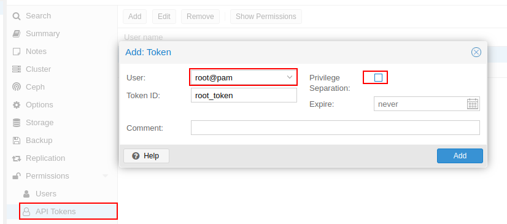
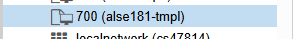
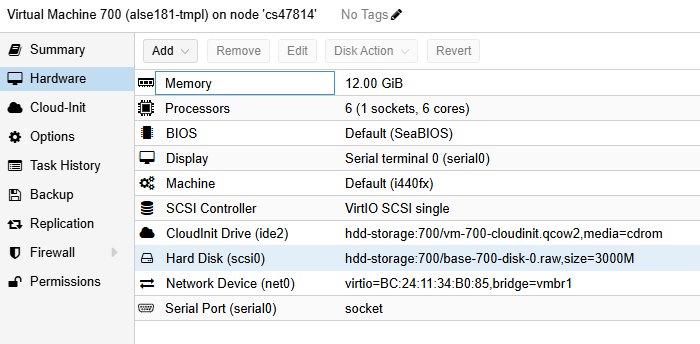
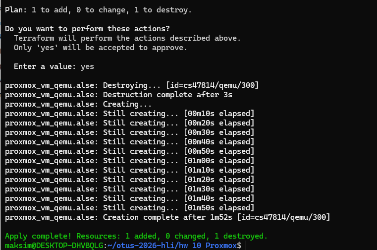
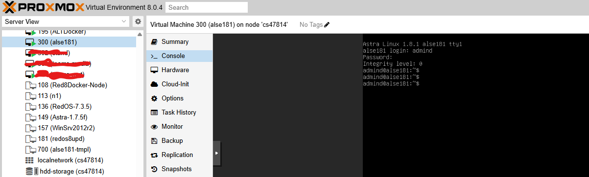
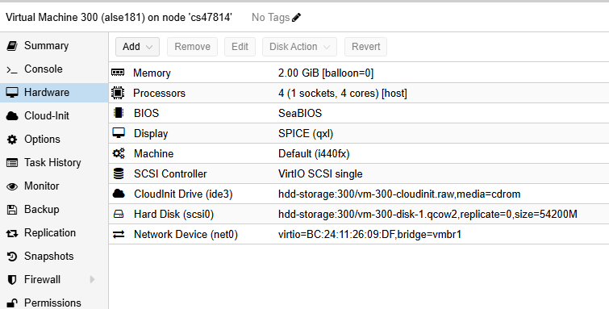

## Домашее задание № 10 Развертывание виртуальных машин на Proxmox с помощью Terraform

### Занятие 19. Виртуализация: Proxmox

#### Цель:

Научиться писать Terraform-скрипты для развёртывания виртуальных машин в Proxmox;

---

#### Описание/Пошаговая инструкция выполнения домашнего задания:

1. Подготовка окружения:

ОС Microsoft Windows 11 WSL 2.0 Ubuntu 22.04
Terraform v1.14.5


2. Написание манифестов Terraform (особенности)

Каждый тип инстанса вынесли в отдельный файл:
|- provider.tf //Объявление провайдера и объявление переменных
|- vmtest.tf //Создание виртуальной машины
|- credentials.auto.tfvars  //Задание переменных доступа к Proxmox (в гите отсутсвует, т.к. чувствительные данные)


Для работы с Proxmox используется провайдер Telmate/proxmox.
Для работы провайдера с Proxmox создаем на Proxmox токен доступа.


Далее для создания вм на proxmox необходимо скачать и настроить шаблон вм типа cloud-image, который оптимизирован на использование в публичных или частных облаках и позваоляет выполнить дополнительную настройку при развертывании.
Для лабораторной работы использую образ cloud-image Astra Linux 1.8.1.





4. Запуск и настройка инфраструктуры 

```
terraform init
terraform validate
terraform plan
terrafrom apply
```

5. Результат

Запускаем создание ВМ в Terraform


Результат:
ВМ создана. Креды для ВМ, заданнные в описании манифеста terraform.


Характеристики вм в Proxmox соответствуют заданным в манифесте. После создания вм были вручную изменен размер диска.



