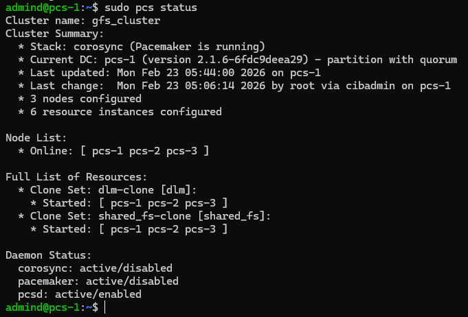
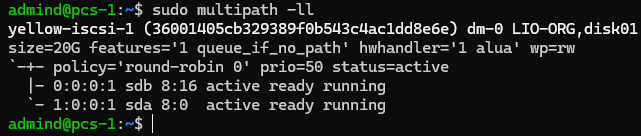
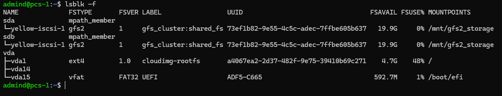
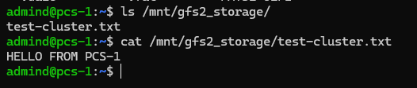
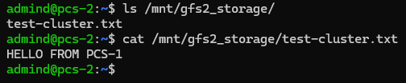

## Домашее задание № 2 GFS2 хранилище в VirtualBox

### Занятие 5. iSCSI, multipath и кластерные файловые системы: GFS2

#### Цель:
Развернуть в VirtualBox конфигурацию для общего хранилища с GFS2, используя Terraform для автоматического создания виртуальных машин;
Настроить базовую конфигурацию GFS2 для совместного использования диска между виртуальными машинами;
---

#### Описание/Пошаговая инструкция выполнения домашнего задания:

1. Подготовка окружения:

ОС Microsoft Windows 11 WSL 2.0 Ubuntu 22.04 Jammy
Ansible 2.12.10
Terraform v1.14.5
Yandex Cloud CLI 0.185.0
Terraform Provider Yanedx v0.187.0

2. Написание манифестов Terraform (особенности)

Каждый тип инстанса вынесли в отдельный файл:
|- iscsi.tf
|- pcs-vms.tf

Доступ к вм настраивается с помощью cloud-init.yml

Выходные переменные - output.tf

Provisioner - Ansible по внешним ip ВМ.

В манифестах используется образ Ubuntu 24.04

3. Написание Ansible playbook (особенности)

Инвентаризационный файл формируется дианмически Terraform.
Созданы следующие роли:
- iscsi //установка и настройка iscsi на серверах и клиентах.
- gfs2 //установка gfs2 на клиентах
- pacemaker //установка и настройка кластера Pacemaker/Corosync. Форматирование и монтирование файловой системы GFS2

Установка и настройка самого кластера проблем не вызвало. Для корректного выполнения должны быть установлены все необходимые пакеты.

При создании ресурса dlm-control были проблемы, что для совместимости он использует путь устройства /dev/misc/, а в новом ядре путь /dev/.
Поэтому пришлось создавать линки на устройства: dlm-control, dlm-monitor, dlm_plock.
```
 - name: Create symlink for dlm-control
      ansible.builtin.file:
        src: /dev/{{ item }}
        dest: /dev/misc/{{ item }}
        state: link
      loop:
        - dlm-control
        - dlm-monitor
        - dlm_plock
```

Далее все по порядку:
- форматирование устройства iscsi GFS2
- монтирование
- определение пордка запуска ресурсов кластера

4. Запуск и настройка инфраструктуры 

```
export YC_TOKEN=$(yc iam create-token)
export YC_CLOUD_ID=$(yc config get cloud-id)
export YC_FOLDER_ID=$(yc config get folder-id)
---
terraform init
terraform validate
terraform plan
terrafrom apply
```

Приходится запускать 2й раз, т.к. не логинится iscsi-клиенты в target. Так и не разобрался почему.

5. Результат

После успешной настройки можно увидить состояние кластера:


Далее мы можем посмотреть что у нас есть связь с ISCSI хостом, на котором располагается хранилище:


Можем увидеть структуру наших блочных устройств:


Тестирование файла:


Видим, что файл отображается на остальных нодах на общем ресурсе:


