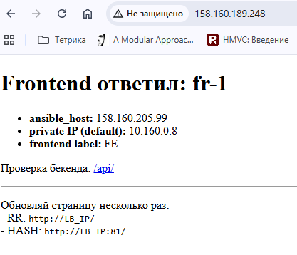
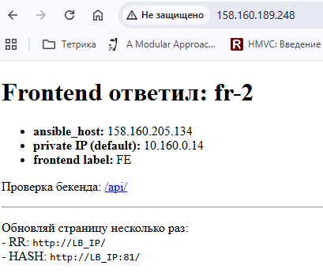
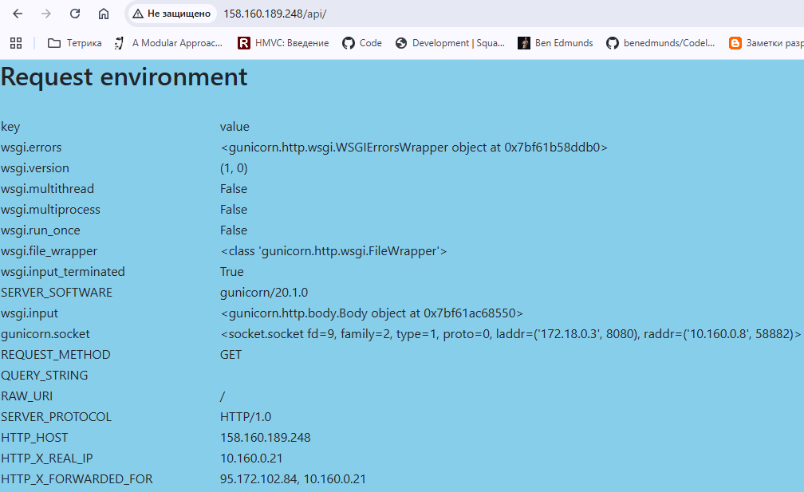
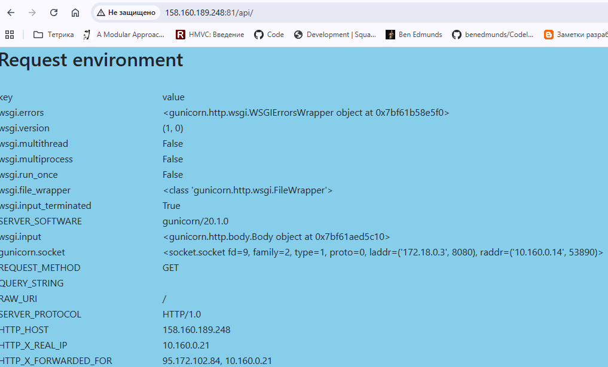

## Домашее задание № 3 Балансировка веб-приложения

### Занятие 6. Nginx - балансировка и отказоустойчивость

#### Цель:
научиться использовать Nginx в качестве балансировщика для веб-приложений;
получить рабочий пример настройки Nginx с базовой отказоустойчивостью бэкенда;
---

#### Описание/Пошаговая инструкция выполнения домашнего задания:

1. Подготовка окружения:

ОС Microsoft Windows 11 WSL 2.0 Ubuntu
Ansible 2.12.3
Terraform v1.14.5
Yandex Cloud CLI 0.185.0
Terraform Provider Yanedx v0.187.0

2. Написание манифестов Terraform (особенности)

Каждый тип инстанса вынесли в отдельный файл:
|- lb.tf
|- frontend.tf
|- backend.tf

Доступ к вм настраивается с помощью cloud-init.yml

Provisioner - Ansible по внешним ip ВМ.

В манифестах используется образ Ubuntu 24.04

Бэкэнд - vscoder/webdebugger

Фронтэнд - Angie

Особенности конфигураций Angie:
- конфигурационные файлы сервер по пути /etc/angie/http.d/
- конфигурационные файлы upstream по пути /etc/angie/stream.d/
- Директория сайта апо умолчанию /usr/share/angie/html

3. Написание Ansible playbook (особенности)

Инвентаризационный файл формируется дианмически Terraform.
Созданы следующие роли:
- angie //установка Angie
- docker //установка Docker
- lbalancer //настройка балансировщика нагрузки по алгоритмам RR и Hash по параметру ip
- fringx //настройка фронтендов (копирование фалйов сайта, настройка конфигурации)
- backend //настройка бэкэнда. КОпирование compose файла с запуском webdebugger

4. Запуск и настройка инфраструктуры 

```
export YC_TOKEN=$(yc iam create-token)
export YC_CLOUD_ID=$(yc config get cloud-id)
export YC_FOLDER_ID=$(yc config get folder-id)
---
terraform init
terraform validate
terraform plan
terrafrom apply
```

5. Результат
На 80 порту слушается алгоритм Round-Robin На 81 порту - hash

Алгоритм RR
Проврека браузером
Видим что балансировщик работает

---


Идет обращение к бэкэнду с каждого фронта

---


Алгоритм Hash по параметру ip


6. Чистим облако за собой

После выполнения всех работ прибиваю все ресурсы
```
terraform destroy
```


