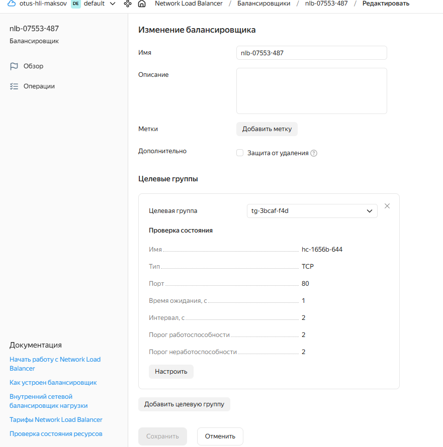
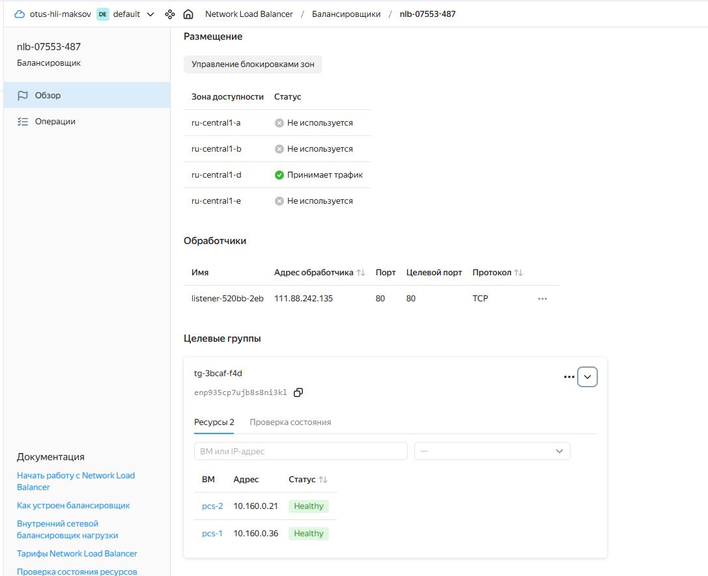
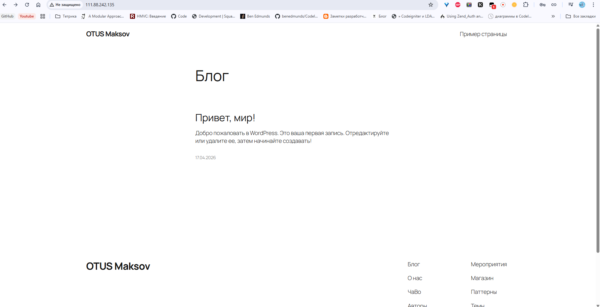

## Домашее задание № 4 Балансировка веб-приложения

### Занятие 10. Альтернативные балансировщики: envoy, traefik

#### Цель:
научиться развертыванию серверов веб-приложения, способного выдерживать высокие нагрузки и обеспечивать отказоустойчивость, используя Terraform (или Vagrant) и Ansible.
---

#### Описание/Пошаговая инструкция выполнения домашнего задания:

1. Подготовка окружения:

ОС Microsoft Windows 11 WSL 2.0 Ubuntu
Ansible 2.12.3
Terraform v1.14.5
Yandex Cloud CLI 0.185.0
Terraform Provider Yanedx v0.187.0

2. Написание манифестов Terraform (особенности)

Каждый тип инстанса вынесли в отдельный файл:
|- lb.tf
|- frontend.tf
|- backend.tf

Доступ к вм настраивается с помощью cloud-init.yml

Provisioner - Ansible по внешним ip ВМ.

В манифестах используется образ Ubuntu 24.04


3. Написание Ansible playbook (особенности)

Инвентаризационный файл формируется дианмически Terraform.
Созданы (или переиспользованы) следующие роли:
- angie - установка веб-сервера Angie, установка портала Wordpress
- bmeme.percona_server - роль из Ansible Galaxy для установки Percona MySQL Server
- iscsi //установка и настройка iscsi на серверах и клиентах.
- gfs2 //установка gfs2 на клиентах
- pacemaker //установка и настройка кластера Pacemaker/Corosync. Форматирование и монтирование файловой системы GFS2


4. Запуск и настройка инфраструктуры 

```
export YC_TOKEN=$(yc iam create-token)
export YC_CLOUD_ID=$(yc config get cloud-id)
export YC_FOLDER_ID=$(yc config get folder-id)
---
terraform init
terraform validate
terraform plan
terrafrom apply
```
Проблема: с первого раза не происходит авторизация клиентотв iSCSI на сервере. Приходится запускать ansible еще раз. Так и не понял проблему. Увеличивал таймут, но непомогло.

5. Создание сетевого балансировщика

Балансировщик создавался с помощью Wizard.


Статус сетевого балансировщика и целевой группы


6. Результат
Портал Wordpress доступен по внешнему ip-адресу сетевого балансирощика.



