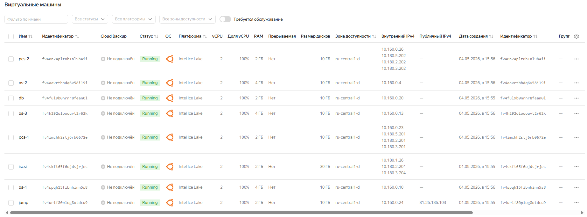
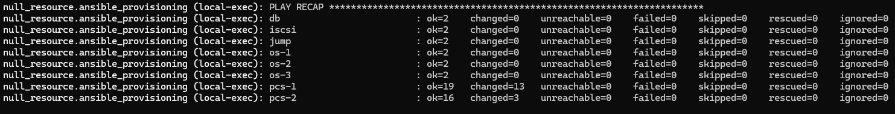
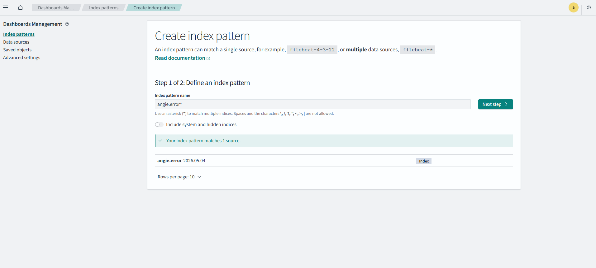
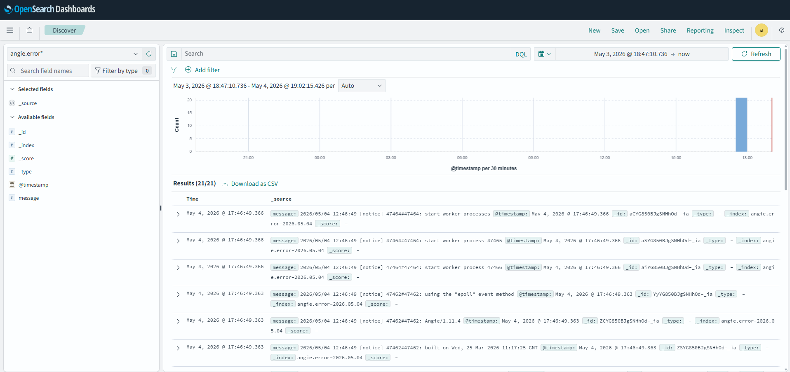

## Домашее задание № 7 Настройка централизованного сбора логов в кластер Elasticsearch

### Занятие 14. Elasticsearch

#### Цель:
---
развернуть отказоустойчивый кластер Elasticsearch;
централизованно собирать логи с серверов проекта;
обеспечить визуализацию логов для мониторинга и диагностики.
---

#### Описание/Пошаговая инструкция выполнения домашнего задания:
---
1. Подготовка окружения:

ОС Microsoft Windows 11 WSL 2.0 Ubuntu 22.04
Ansible 2.12.3
Terraform v1.14.5
Yandex Cloud CLI 1.0.0
Terraform Provider Yandex v0.200.0

2. Написание манифестов Terraform (особенности)

Каждый тип инстанса вынесли в отдельный файл:
|- db.tf
|- pcs-vms.tf
|- os-vms.tf
|- iscsi.tf
|- jump.tf

Доступ к вм настраивается с помощью cloud-init.yml

Так как на YandexCloud ограничено количество выделяемых публичных IP адресов, в качестве JumpHost, через который будем подключаться по SSH (в частности для Ansible) к другим серверам той же подсети будем использовать сервер jump.

В манифестах используется образ Ubuntu 24.04

Opensearch развернём на кластере из трёх нод os-1, os-2, os-03. На бэкендах (pcs-1 и pcs-2) и БД (db) будет установлен fluentd для отправки логов в Opensearch. 
Веб-панель Dashboard-Opensearch будет установлена на Jump сервере.

3. Написание Ansible playbook (особенности)

Инвентаризационный файл формируется дианмически Terraform.
Созданы (или переиспользованы) следующие роли:
- angie - установка веб-сервера Angie, установка портала Wordpress
- bmeme.percona_server - роль из Ansible Galaxy для установки Percona MySQL Server
- iscsi //установка и настройка iscsi на серверах и клиентах.
- gfs2 //установка gfs2 на клиентах
- pacemaker //установка и настройка кластера Pacemaker/Corosync. Форматирование и монтирование файловой системы GFS2
- opensearch //установка и настройка Opensearch (готовая роль с Github)
- dashboards //установка и настройка Dashboards (готовая роль с Github)
- filebeats //установка и настройка сборщика логов Fluentd


4. Запуск и настройка инфраструктуры 

```
export YC_TOKEN=$(yc iam create-token)
export YC_CLOUD_ID=$(yc config get cloud-id)
export YC_FOLDER_ID=$(yc config get folder-id)
---
terraform init
terraform validate
terraform plan
terrafrom apply
```
Проблемы: 
- с первого раза не происходит авторизация клиентотв iSCSI на сервере. Приходится запускать ansible еще раз. Так и не понял проблему. Увеличивал таймут, но непомогло.
- Playbook необходимо запускать несколько раз. Были форсмажорные остановки выполнения playbook.
- Fluentd устанавливается автоматически. Но требуется ручная донастройка. В итоговом проекте будет  поправлено для полной автоматизации.

5. Результат
Список вм Yandex Cloud


Результат отработки playbook


Страница OpenSearch Dashboard открывается в браузере, вводя в адресную строку публичный IP адрес сервера jump с портом 5601:


Кликаем на "Главное меню", выбираем "Discover"

Кликаем по кнопке "Create index pattern":
Настраиваем индексы, которые передают клиенты Fluentd


Снова кликаем по кнопке "Главное меню" и выбираем "Discover":
Выбираем необходимый индекс.

Получаем следующую картину:



Можно делать вывод, что OpenSearch кластер корректно функционирует, собирает логи со всех серверов данного стенда.


