## Домашее задание № 9 Consul cluster для service discovery и DNS

### Занятие 17. Consul

#### Цель:

настроить Consul cluster для управления DNS-записями веб-портала;
реализовать отказоустойчивую балансировку нагрузки через DNS вместо плавающего IP;
---

#### Описание/Пошаговая инструкция выполнения домашнего задания:

1. Подготовка окружения:

ОС Microsoft Windows 11 WSL 2.0 Ubuntu 22.04
Ansible 2.12.3
Terraform v1.14.5
Yandex Cloud CLI 1.0.0
Terraform Provider Yandex v0.200.0

2. Написание манифестов Terraform (особенности)

Каждый тип инстанса вынесли в отдельный файл:
|- db.tf
|- pcs-vms.tf
|- cs-vms.tf
|- iscsi.tf

Доступ к вм настраивается с помощью cloud-init.yml

Так как на YandexCloud ограничено количество выделяемых публичных IP адресов, в качестве JumpHost, через который будем подключаться по SSH (в частности для Ansible) к другим серверам той же подсети будем использовать сервер jump.

В манифестах используется образ Ubuntu 24.04

Consul-server развернём на кластере из трёх нод cs-1, cs-2, cs-03. На бэкендах (pcs-1 и pcs-2) будут установлены клиентские версии Consul.  На бэкендах будут установлены wordpress. Проверка (check) на доступность сервисов на клиентских серверах будет осуществляться по http.

3. Написание Ansible playbook (особенности)

Инвентаризационный файл формируется дианмически Terraform.
Созданы (или переиспользованы) следующие роли:
- angie - установка веб-сервера Angie, установка портала Wordpress
- bmeme.percona_server - роль из Ansible Galaxy для установки Percona MySQL Server
- iscsi //установка и настройка iscsi на серверах и клиентах.
- gfs2 //установка gfs2 на клиентах
- pacemaker //установка и настройка кластера Pacemaker/Corosync. Форматирование и монтирование файловой системы GFS2
- consul //установка и настройка серверов Consul, а также клиентов Consul(в зависимости от роли)


4. Запуск и настройка инфраструктуры 

```
export YC_TOKEN=$(yc iam create-token)
export YC_CLOUD_ID=$(yc config get cloud-id)
export YC_FOLDER_ID=$(yc config get folder-id)
---
terraform init
terraform validate
terraform plan
terrafrom apply
```
Проблема: с первого раза не происходит авторизация клиентотв iSCSI на сервере. Приходится запускать ansible еще раз. Так и не понял проблему. Увеличивал таймут, но непомогло.


5. Результат
Список участников Consul
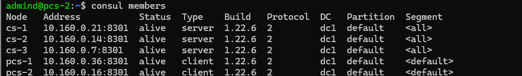

Список сервисов Consul
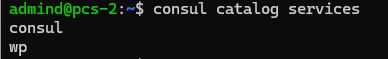

DNS Зона прямого просмотра:
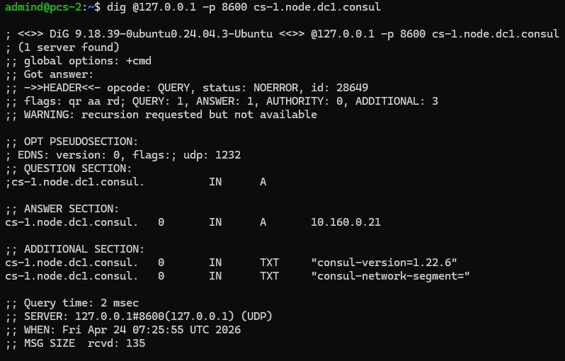

DNS Зона обратного просмотра:
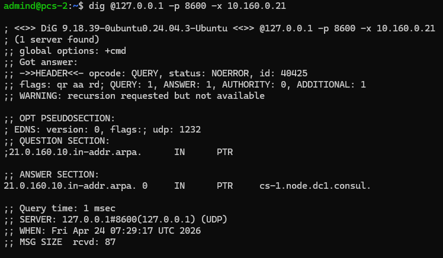

Список серверов в домене wp.service.consul:
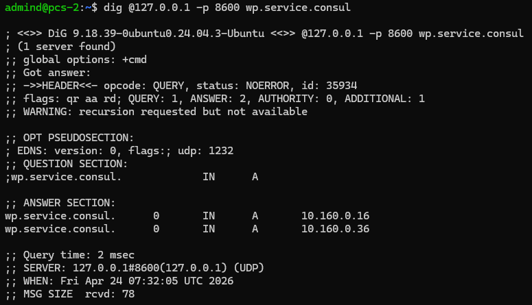
---
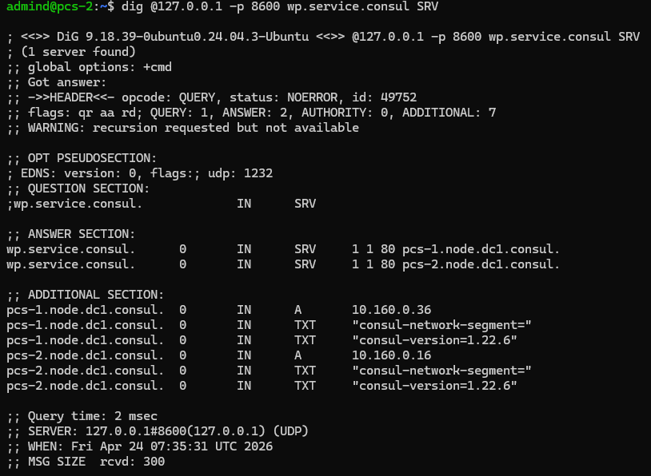

На бэкенд-сервере pcs-2 остановим сервис angie:
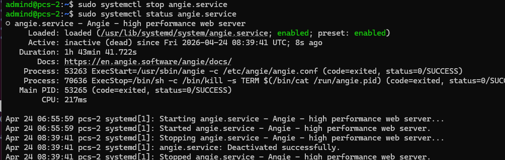

Проверям сервис:
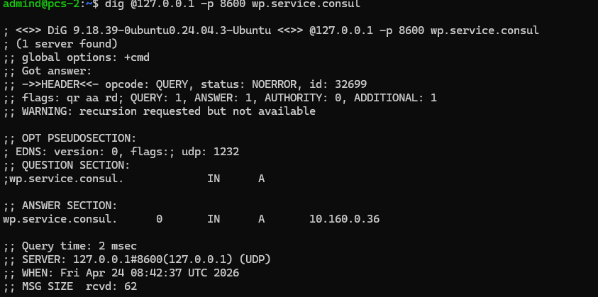
---
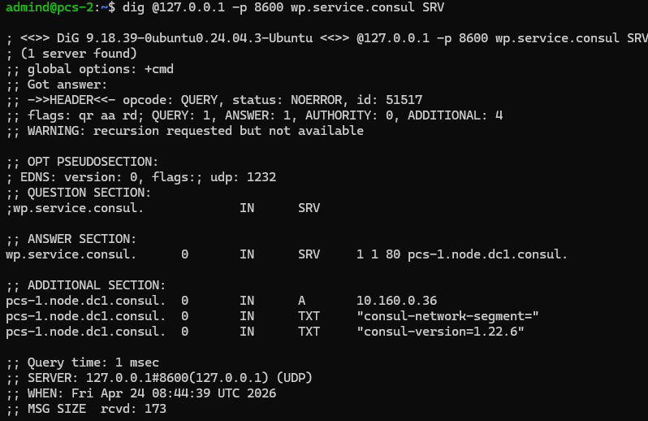

Как видим, работает consul сервис "wp" на сервере pcs-1 с ip адресом 10.160.0.36.

Как это выглядит в браузере
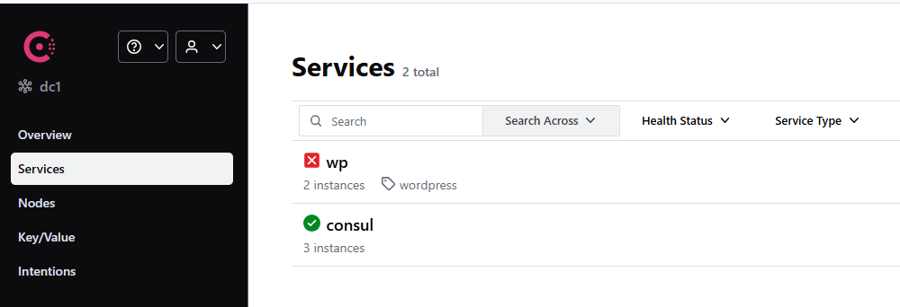
---
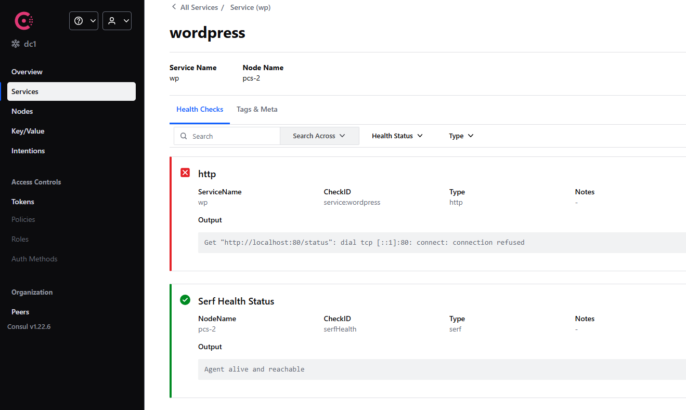

Востанавливаем сервис на pcs-2 (запускаем angie)
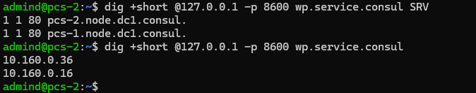

Можно сделать вывод, что развёрнутая система с установленным и настроенным consul сервисом работает должным образом.


